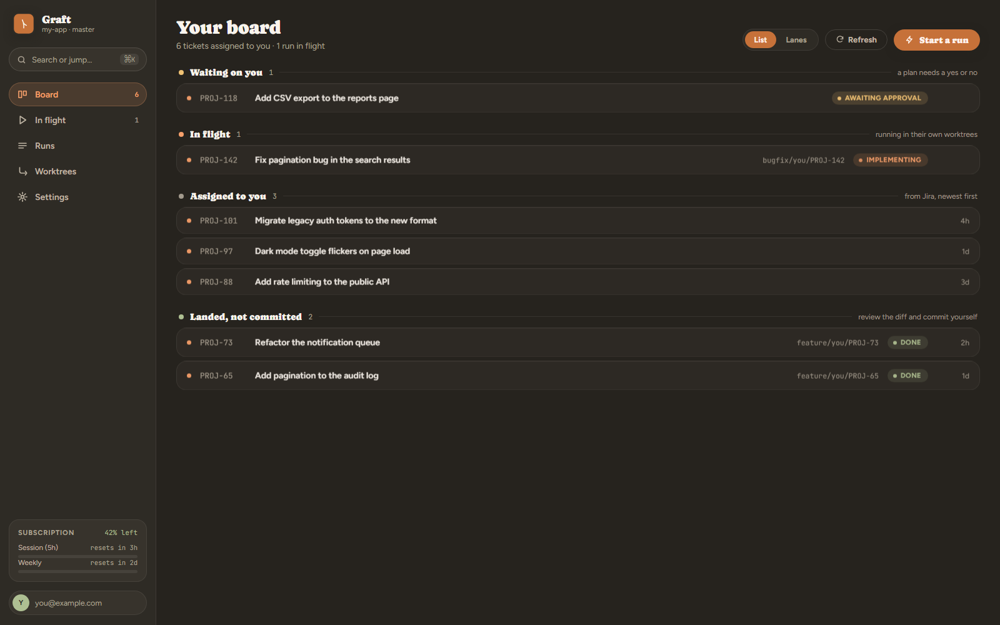
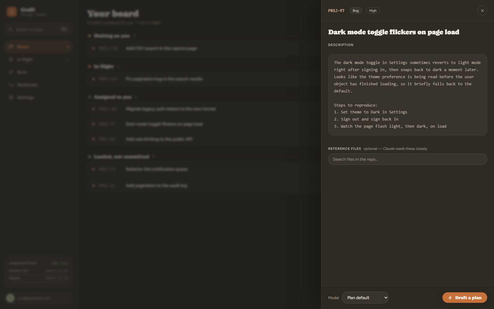
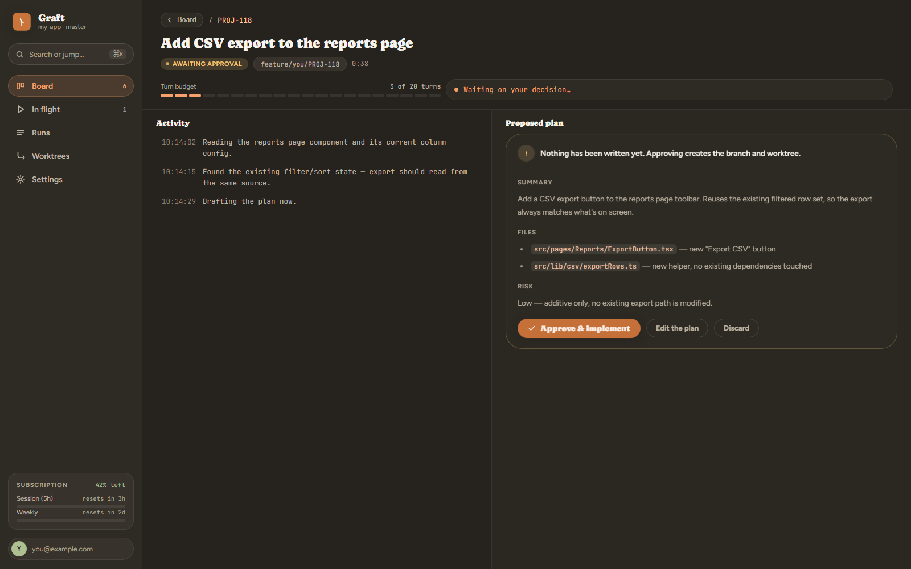
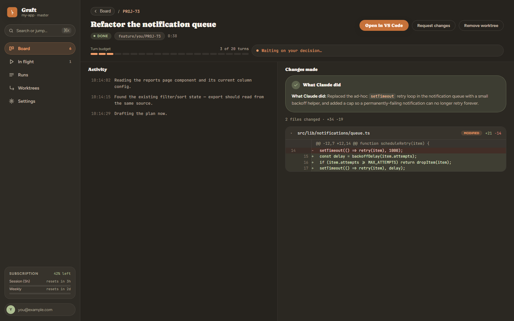
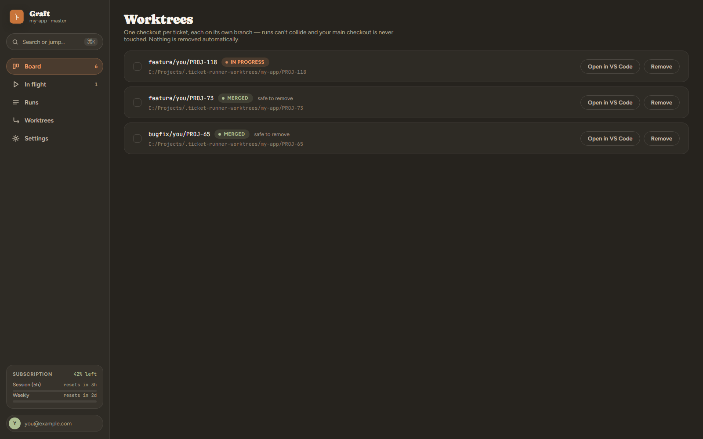

# Graft

Graft is a local dashboard: it shows the Jira tickets assigned to you, and for
any of them, has Claude Code draft an implementation plan, wait for your
approval, then implement it on its own branch — with live progress you can
watch. Ticket implementation never commits or pushes on its own; you review
the diff and commit yourself when you're happy.

It also has a **Release** tool: pick a destination branch and an ordered list
of source branches, and it merges them in one at a time — each merge sees the
result of the one before it, not a stale snapshot — skipping and reporting
any that conflict instead of guessing. This is the one part of Graft that
does push to your remote, and only when you explicitly ask it to.

It runs entirely on your machine. There's no cloud backend and no separate
service to deploy — the Node server on your laptop talks to Jira's API, your
local git repo, and your local `claude` CLI, using your existing Claude
subscription rather than API credits.



**Stack, for developers sizing up the code before diving in:** a Node.js +
Express backend with no database (state is flat JSON under `data/`), and a
frontend that's plain HTML/CSS/JS — no framework, no bundler, no build step.
See [CONTRIBUTING.md](CONTRIBUTING.md) for the project layout.

## Contents

- [How it works, in short](#how-it-works-in-short)
- [One-time setup](#one-time-setup)
- [Running it](#running-it)
- [How runs are isolated](#how-runs-are-isolated)
- [Releasing: merging branches into a release branch](#releasing-merging-branches-into-a-release-branch)
- [Notifications](#notifications-both-optional)
- [Verification commands](#verification-commands)
- [Important limitations, on purpose](#important-limitations-on-purpose)
- [If the server is stopped mid-run](#if-the-server-is-stopped-mid-run)
- [Updating](#updating-git-pull)
- [Platform notes](#platform-notes)
- [Contributing](#contributing)
- [License](#license)

## How it works, in short

1. **Pick a ticket** from your board — it's whatever's currently assigned to
   you in Jira, grouped by what needs your attention.
2. **Draft a plan.** Claude reads the codebase and writes up what it intends
   to do — no files are touched yet.
3. **You approve, edit, or discard it.** Nothing is written until you say go.
4. **It implements the plan** in its own git worktree, on its own branch, so
   it can never collide with another run or your own uncommitted work.
5. **You review the diff** and commit it yourself — Graft never runs
   `git commit` or `git push`.

|                        |                         |                       |
| :--------------------: | :---------------------: | :-------------------: |
|  |  |  |
| Open a ticket, see its full description | Approve the plan before anything is written | Review a real diff when it's done |

## One-time setup

1. **Install dependencies:**
   ```bash
   npm install
   ```

2. **Get a Jira API token:**
   https://id.atlassian.com/manage-profile/security/api-tokens → Create API token

3. **Configure:**
   ```bash
   cp .env.example .env
   ```
   Edit `.env` and fill in:
   - `JIRA_DOMAIN` — e.g. `yourcompany.atlassian.net`
   - `JIRA_EMAIL` — your Jira login email
   - `JIRA_API_TOKEN` — the token from step 2
   - `REPO_PATH` — absolute path to your local git repo
   - `BASE_BRANCH` — usually `main`

4. **Make sure Claude Code is logged in via subscription, not an API key:**
   ```bash
   claude auth status
   echo $ANTHROPIC_API_KEY   # should print nothing
   ```
   If `ANTHROPIC_API_KEY` is set anywhere in your shell config, remove it —
   otherwise Claude Code will bill against API credits instead of your
   subscription. The server will also print a warning at startup if it detects
   this.

5. **Make sure `code` (the VS Code CLI) is on your PATH:**
   In VS Code, open the Command Palette (`Cmd/Ctrl+Shift+P`) → "Shell Command:
   Install 'code' command in PATH".

## Running it

```bash
npm start
```

The console prints a setup check on startup — anything wrong with your local
setup (Claude CLI not on PATH, not logged in, git missing, no Jira token, no
project selected) is listed there in plain language, with how to fix it. The
same check lives in the dashboard: **Settings → Setup status**, re-checked
automatically whenever you save something that could resolve it. If Jira or a
project isn't configured yet, the Board page shows a banner pointing you there.

Then open http://localhost:4177 in your browser.

- The board lists tickets currently assigned to you (excludes Done/Closed).
- Click one to see its full description, comments, and linked issues.
- Click **Draft a plan**. Claude drafts an implementation plan and waits for
  your approval; clicking **Approve & implement** creates the branch and
  worktree and starts the run.
- The progress view shows: elapsed time, current activity (what file Claude's
  reading/editing, what command it's running), and a turn-count bar against the
  turn budget (30 turns by default — set `maxTurns` / `planMaxTurns` in
  `data/settings.json` to change it).
- When it finishes, review the summary and diff, then **Open in VS Code** to
  inspect and commit yourself, or **Request changes** to iterate in the same
  Claude session.

## How runs are isolated

Each approved ticket is implemented in its own **git worktree** — a separate
checkout of the same repository, on its own branch, sharing one `.git`:

```
…/Projects/my-app/                          ← your checkout, never touched
…/Projects/.ticket-runner-worktrees/my-app/
    PROJ-101/   ← branch feature/you/PROJ-101
    PROJ-142/   ← branch bugfix/you/PROJ-142
```



That means:

- **Tickets run in parallel.** Two runs can't collide, and neither can move the
  other's `HEAD` mid-run.
- **Your working tree is left alone.** No `checkout`, no `pull`, and you stay on
  whatever branch you were on with your own uncommitted work intact.
- **Diffs are exact.** "Changes made" shows only that ticket's changes, and it's
  computed against the base branch — so it stays correct after you stage or even
  commit the work.

To review a run: open it in VS Code from the dashboard (that opens its worktree),
or `cd` into the worktree and use git normally. Note that a branch checked out in
a worktree can't be checked out again in your main clone — review it in the
worktree, or remove the worktree first.

Worktrees are never deleted automatically. Settings → Worktrees lists them and
flags any whose branch has already landed in the base branch as safe to remove;
each finished run also has a **Remove worktree** button.

**Dependencies:** a new worktree contains tracked files only, so `node_modules`
is linked (junction/symlink) from your main checkout to make lint/test commands
work immediately. If a ticket changes `package.json` or a lockfile, the run says
so — install inside that worktree before trusting its test results.

## Releasing: merging branches into a release branch

The **Release** tab handles the "merge a batch of finished ticket branches
into a release branch" step that normally means rebasing everything against
the same snapshot and then discovering conflicts one at a time, deep inside a
Bitbucket/GitHub merge screen, with no idea up front which branch will cause
one.

1. Pick a **destination branch** from the dropdown — or **+ Create a new
   branch…** if this sprint's release branch doesn't exist yet (it's created
   from your configured base branch).
2. Pick **source branches** from the list — read live from your Git remote
   (`git ls-remote`, no local fetch required), so it always reflects what's
   actually on the remote right now — and put them in the order you want
   them merged.
3. Click **Run release**. Graft merges them into the destination **one at a
   time, in a throwaway worktree** — so each merge sees the *result* of the
   one before it, not a stale snapshot. That's the actual fix for the classic
   failure mode: rebasing every branch against the same starting point only
   guarantees the *first* one merges cleanly, not the rest.
4. A branch that conflicts is aborted and skipped, not resolved automatically
   — only a human should decide which side of a real conflict wins — and
   reported with the exact files involved. The rest still merge.
5. Once merging finishes, review the per-branch results, then **Push to
   origin** as a separate, explicit step. Nothing reaches your remote until
   you click it — or **Discard** to walk away without pushing anything.

Two things worth knowing:

- **This does push for real.** Unlike ticket implementation, a release push
  updates `origin/<destination branch>` on your actual remote. Review the
  results before clicking Push.
- **Protected branches still apply.** If your remote rejects direct pushes to
  the destination branch (e.g. a Bitbucket/GitHub rule requiring merges via
  pull request), Graft shows that rejection verbatim rather than failing
  silently — it can't override a server-side permission.

## Notifications (both optional)

- **Desktop notifications** — browser/OS notification when a plan needs approval
  or a run ends. Off until you grant permission in Settings.
- **Telegram** — reaches you with the dashboard closed. Off by default: saving a
  bot token does **not** start sending messages. Add the token and chat ID, use
  **Send test message** to check them (this works while the feature is still
  off), then tick **Send me Telegram notifications** to switch it on. Untick it
  any time to go quiet without deleting your credentials.

## Verification commands

By default Claude may run `npm run lint` / `npm test`. For a non-Node project,
set the right commands under **Settings → Verification commands** — they're saved
per project and granted to the run, so Claude can actually check its own work.
Plain commands only (no quotes, pipes, or chaining); anything that could smuggle
a second command is rejected.

## Important limitations, on purpose

- **No ETA.** How long a ticket takes depends on its complexity in ways that
  can't be predicted upfront. The progress bar reflects turns used against the
  turn budget, not time-to-completion — treat it as "how much of its budget
  it's used," not "% done."
- **No auto-commit, no auto-push — for ticket implementation.** This is
  enforced by never granting the `Bash(git commit*)` / `Bash(git push*)`
  patterns in `--allowedTools` inside `lib/claudeRunner.js`. Don't add them
  unless you actually want that. The one deliberate exception is the
  [Release tool](#releasing-merging-branches-into-a-release-branch)'s
  explicit **Push to origin** button — a separate code path, not something
  Claude ever does on its own.
- **Nothing is cleaned up for you.** Branches and worktrees stay until you
  remove them. That's deliberate — the alternative is deleting work you hadn't
  finished reviewing.
- **Single-user, local only.** There's no auth on the dashboard itself — it's
  meant to run on `localhost` for you alone, not to be exposed on your network.
  Setting `HOST` to a non-loopback address does work, but it publishes a service
  that runs code on your machine to anyone who can reach the port.

## If the server is stopped mid-run

Quitting with Ctrl+C kills the active `claude` processes and parks their runs.
They come back in the dashboard as **Paused**; press **Continue** to resume the
same Claude session, with the partial changes still in the run's worktree.

## Updating (`git pull`)

Safe to do any time, running or not. Settings are read as
`{ ...defaults, ...whatever's saved }`, so a config file from an older version
of this tool just picks up new settings at their default — nothing is lost,
nothing needs migrating by hand.

**Restart after pulling.** `public/*` (HTML/CSS/JS) is served fresh on every
request, so frontend changes show up on your next page reload with no
restart needed. `server.js` and everything under `lib/` are only read once,
at process startup, though — if an update touches either, a running instance
keeps serving the old routes/logic until you stop and re-run `npm start`.

## Platform notes

Built and exercised end-to-end on Windows. macOS/Linux are supported in code
(`lib/claudeBin.js` resolves `claude` on PATH the normal POSIX way) and covered
by unit tests, but not yet run against a real Mac/Linux machine — if `claude`
doesn't spawn there, **Settings → Setup status** will say so specifically
rather than leaving you with a bare `ENOENT`. If you hit something, please open
an issue with what that check reported.

## Contributing

Contributions are welcome — see [CONTRIBUTING.md](CONTRIBUTING.md) for how to
get set up, run the test suite, and submit a pull request. Testing this on a
real macOS or Linux machine and reporting back is especially valuable, since
that's currently the biggest untested gap.

## License

[MIT](LICENSE)
